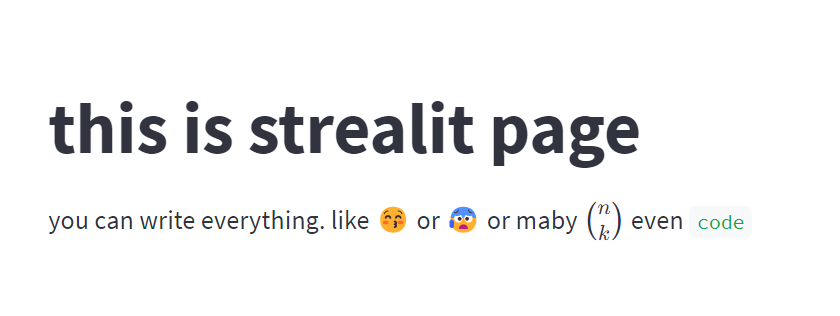

<div dir="rtl">
    
    
# Streamlit או איך לפרסם את הקוד שלך

## מה זה ***********Streamlit?***********

סטרימליט *************streamlit************* היא חבילה שמאפשרת לפרסם בקלות ממשק ווב לקובץ פייתון. 

זאת חבילה מתוחזקת היטב, שמתאימה לשימושים של דף סטאטי.

יהחבילה פשוטה מאוד, יש  אובייקט `st`  בסיסי, וכל מתודה שתקראו על האובייקט הזה יפיע מיד בדף

```python
import streamlit as st
st.write('''# this is strealit page
you can write everything. like 😚 or 😰 or _maby_  $\\binom{n}{k}$
even `code`''')
```



## המרכיבים של דף Streamlit

חוץ מטקסט סטסטי (שנראה טוב) יש לStreamlit הרבה רכיבים שמתקשרים עם המשתמש, כאלה גם שיכולים לקבל קלט, כמו טקסט, לחיצה  על כפתור או העלאה של קובץ.

את האינפוט שמקבלים מהמשתמש ניתן לשמור ולטפל בו (בצורה מסויימת)

```python
import streamlit as st
unser_choice = st.text_input("Enter your choice")
if st.button("I want to choice form list:"):
    unser_choice = st.multiselect("Your choice", ["A", "B", "C"])
name = st.text_input("enter name")
if name:
    st.write(name)
```


## עקרון הפעולה של סטרימליט

בסטרימליט יש עיקרון פשוט - כל פעם שיש שינוי מצד המשתמש, גם השינוי הקטן ביותר, המנוע קורא את הקוד מהתחלה ומבצע אותו. כאשר בסיבוב החדש יש ערכים חדשים במשתנים.

התבוננו בקוד של הפיסקה הקודמת, לאחר שהמשתמש בוחר באות מתוך רשימת האותיות, המנוע חוזר וקורה את הקוד מהתחלה. מכיון שבקריאה החדשה הכפתור `st.button("...")`  לא לחוץ התפריט מוסתר. 

צורת העבודה הזאת נוחה מצד אחד, כי היא מאפשרת כתיבה של קוד כאשר סדר ביצוע הפעולות ידוע. 

מצד שני זה נראה שאין אפשרות באמת לכתוב קוד דינמי, כזה שמקבל קלט מהמשתמש ומסוגל לשמור ולעשות איתו דברים. 

לדוגמה הוצאה או הוספה של פריטים לרשימה נעשית לא רלוונטית בדף סטרימליט. 

```python
import streamlit as st
my_list = []
num = st.number_input("enter number to list")
button = st.button("append to list")
if button:
    my_list.append(num)
st.write(my_list)
```


## הריצות השונות

עלינו לשאול את עצמנו מה ראה המנוע של סטרימליט בכל סיבוב. 

- בסיבוב הראשון, המנוע רנדר את הרכיבים השונים, כמובן שהמשתנים היו ללא ערך.
- לאחר שהזנו מספר ולחצנו על הכפתור, המנוע של סטרימליט קרא את כל הקוד מהתחלה, כלומר רנדר שוב את הרכיבים השונים מהתחלה.  כעת בשתי משתנים היו ערכים - בתוך `num` היה מספר שהגיע מהיוזר, והערך של `button` הוא *****True***** ולא ****False.**** לכן היה ניתן לראות את הערך  שנוסף לתוך הרשימה.
- לאחר מכן, כאשר המשתמש הוסיף מספר ולחץ על ******Enter****** זה הספיק למערכת בשביל לקרוא את הקוד מהתחלה. הרשימה התאפסה ואיבדנו את הערך מהריצה  הקודמת, מכיון שהערך של `button` היה *****False*****, (כי הספיקה לחיצת Enter בשביל להריץ את הקוד מהתחלה)  גם את המספר שיהיה בתוך `num`  לא נכנס לתוך הרשימה.

העיקרון הזה של הריצה מחדש בכל אינטרקציה של המשתמש מהווה את הרעיון המרכזי בכל פיתוח עם סטרימליט. שים לב שאתה מבין היטב את הנושא הזה.

## שומר הפלאים `session_state`

## מידע מקבצים אחרים

## גישה לפיתוח

## לסיכום
    
    </div>
